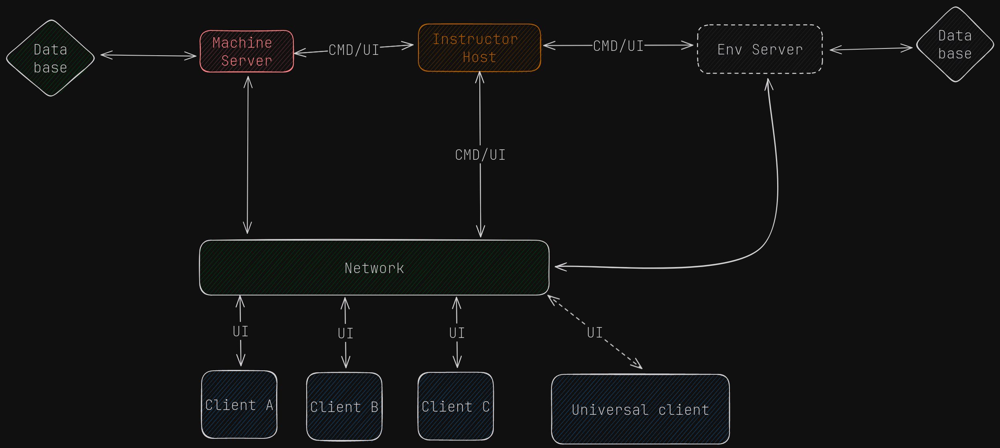

<div align="center">
  <a href="https://github.com/EANsim/gecko">
    
  </a>
  <h3 align="center">Project gecko</h3>

  <p align="center">
    The SA-8 Gecko simulator repo is a software repository that aims to simulate the functionality and behavior of the SA-8 Gecko missile system
    <br />
    <a href="https://github.com/EANsim/project-gecko-legacy/tree/master/Docs"><strong>Explore the docs »</strong></a>
    <br />
  </p>
</div>

## Recommended IDE Setup

For the best development experience, we recommend using one of the following IDE setups:

- [VS Code](https://code.visualstudio.com/)
  with [Svelte extension](https://marketplace.visualstudio.com/items?itemName=svelte.svelte-vscode)

  or

- [RustRover](https://www.jetbrains.com/rust/) with [Svelte plugin](https://plugins.jetbrains.com/plugin/12375-svelte)

For more information on debugging:

- RustRover: [Debugging with RustRover](https://tauri.app/v1/guides/debugging/rustrover/)

  or

- VsCode: [Debugging with VsCode](https://tauri.app/v1/guides/debugging/vs-code/)

## How to Start Working?

### 1. Install Prerequisites

Make sure you have all the necessary prerequisites installed by following the
instructions [here](https://tauri.app/v1/guides/getting-started/prerequisites/).

Also make sure to install `python3` in order to work with some tools.

### 2. Install Dependencies

Navigate to the project root directory and install dependencies by running:

1. **Install `tauri-cli` interface to interact with tauri app**

```bash
cargo install tauri-cli
```

2. **Navigate to the project root directory and install dependencies by running:**

```bash
npm install
```

### 3. Run in Development Mode

To run the application in development mode, execute:

```bash
cargo tauri dev
```

### 4. Build Production-Ready Application

To build a production-ready version of the application, use the following command:

```bash
cargo tauri build
```

### 5. Pre-commit hooks for contributing (MUST HAVE)

To ensure smooth and efficient workflow, it's essential to install pre-commits configured in
the `.pre-commit-config.yaml` file. Follow these steps to install and utilize the pre-commit hooks:

1. **Navigate to Repository Root:**
   Open a terminal and navigate to the root directory of your repository.
2. **Install Pre-Commit:**
   Execute the following command to install pre-commit:

```bash
pip install pre-commit
```

3. **Set Up Pre-Commit Hooks:**
   Run the following command to set up pre-commit hooks:

```bash
pre-commit install
```

4. **Verify the installation:**

```bash
pre-commit --version
```

### 6. Formatting, linting, testing  and other scripts can be found in `package.json`

## Need an official Svelte framework?

<details>

Check out [SvelteKit](https://github.com/sveltejs/kit#readme), which is also powered by Vite. Deploy anywhere with its
serverless-first approach and adapt to various platforms, with out of the box support for TypeScript, SCSS, and Less,
and easily-added support for mdsvex, GraphQL, PostCSS, Tailwind CSS, and more.

</details>

## Technical considerations

<details>

**Why use this over SvelteKit?**

- It brings its own routing solution which might not be preferable for some users.
- It is first and foremost a framework that just happens to use Vite under the hood, not a Vite app.

This template contains as little as possible to get started with Vite + TypeScript + Svelte, while taking into account
the developer experience with regards to HMR and intellisense. It demonstrates capabilities on par with the
other `create-vite` templates and is a good starting point for beginners dipping their toes into a Vite + Svelte
project.

Should you later need the extended capabilities and extensibility provided by SvelteKit, the template has been
structured similarly to SvelteKit so that it is easy to migrate.

**Why `global.d.ts` instead of `compilerOptions.types` inside `jsconfig.json` or `tsconfig.json`?**

Setting `compilerOptions.types` shuts out all other types not explicitly listed in the configuration. Using triple-slash
references keeps the default TypeScript setting of accepting type information from the entire workspace, while also
adding `svelte` and `vite/client` type information.

**Why include `.vscode/extensions.json`?**

Other templates indirectly recommend extensions via the README, but this file allows VS Code to prompt the user to
install the recommended extension upon opening the project.

**Why enable `allowJs` in the TS template?**

While `allowJs: false` would indeed prevent the use of `.js` files in the project, it does not prevent the use of
JavaScript syntax in `.svelte` files. In addition, it would force `checkJs: false`, bringing the worst of both worlds:
not being able to guarantee the entire codebase is TypeScript, and also having worse typechecking for the existing
JavaScript. In addition, there are valid use cases in which a mixed codebase may be relevant.

**Why is HMR not preserving my local component state?**

HMR state preservation comes with a number of gotchas! It has been disabled by default in both `svelte-hmr`
and `@sveltejs/vite-plugin-svelte` due to its often surprising behavior. You can read the
details [here](https://github.com/rixo/svelte-hmr#svelte-hmr).

If you have state that's important to retain within a component, consider creating an external store which would not be
replaced by HMR.

```ts
// store.ts
// An extremely simple external store
import {writable} from 'svelte/store'

export default writable(0)
```

</details>


## Project Architecture

The project architecture delineates the major milestones and tasks for the development of the project. For a detailed breakdown, refer to the [project milestones](https://github.com/EANsim/gecko/milestones).



### Priority Color Codes:

1. Red
2. Orange
3. Green
4. Blue
5. Gray

## License

This project is licensed under the [Special License](LICENSE). Please refer to the LICENSE file for further information.
